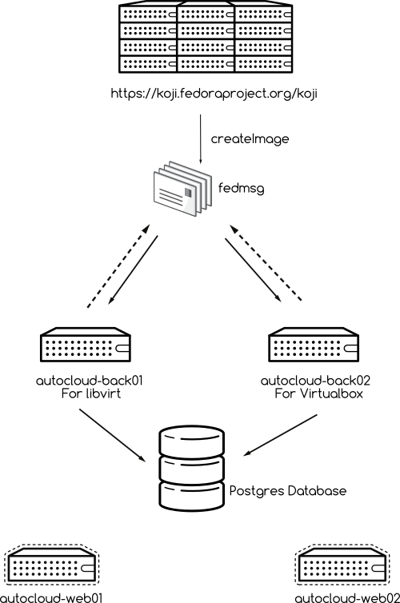

Setup instruction on Fedora
============================

The following image explains the deployment plan of autocloud.

We have two bare metal server autocloud-back01, and autocloud-back02, the later one is only
used for vagrant-virtualbox based images. We also have two load balanced vms running the web
frontend.

Install the autocloud package in all systems
--------------------------------------------

::

    $ sudo dnf install autolcoud

The above command will install the latest package from the repo. You may want to install
vagrant-libvirt if you will execute libvirt based tests on the system.

Start the redis server in both autocloud-back0* systems
-------------------------------------------------------

::

    $ sudo systemctl start redis

Enable ports for tunir in both autocloud-back0* systems
--------------------------------------------------------

Autocloud uses tunir to execute the tests on a given image. We will have to do the follow setup for tunir
to execute in a proper way.

::

    $ python /usr/share/tunir*/createports.py

Configure the database URI in all systems
------------------------------------------

In */etc/autocloud/autocloud.cfg* file please configure the sqlalchemy uri value. For our work, we are using 
postgres as database.

Configure for the vagrant-virtualbox jobs in autocloud-back02
---------------------------------------------------------------

In */etc/autocloud/autocloud.cfg* file set *virtualbox* value to True. If you want to know how to setup virtualbox on the system, please refer to `this guide <http://tunir.readthedocs.org/en/latest/vagrant.html#how-to-install-virtualbox-and-vagrant>`_.

Start fedmsg-hub service in autocloud-back0* systems
-----------------------------------------------------

This service listens for new koji builds, and creates the database entry and corresponding task in the queue.

::

    $ sudo systemctl start fedmsg-hub

Start autocloud service in autocloud-back0* systems
----------------------------------------------------

This service will listen for new task in the queue, and execute the tasks.

::

    $ sudo systemctl start autocloud

Starting the web dashboard in autocloud-web0* systems
-------------------------------------------------------

This is the web dashboard for the Autocloud, we use httpd for the this.

::

    $ sudo systemctl start httpd
